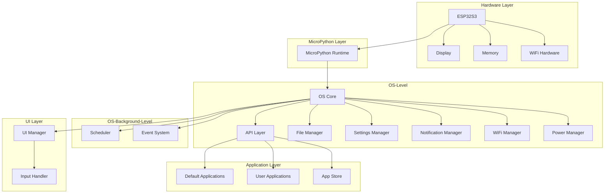
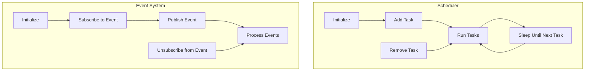
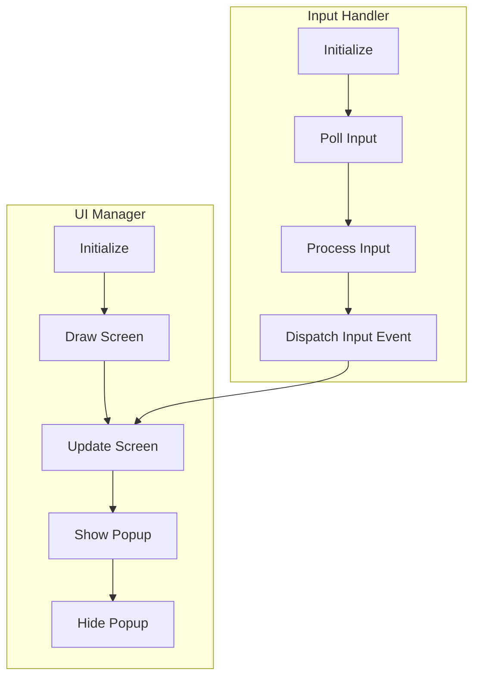
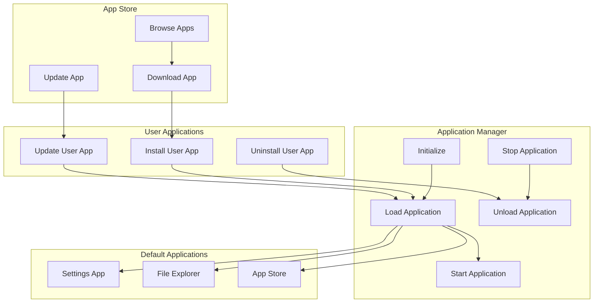

# General Purpose PDA
I'm working on this thing as a sort-of passion project, just to mess around and learn how hardware development works.

Oh, and to also practice writing python since I haven't done so for a long time.

## Materials
- ESP32-S3-Touch-4.3-LCD from **WaveShare**
- 3D printed case (.stl files here later)
- A Type-C cable on both ends or on one end
- A computer with a USB/Type-C port

I use macOS. I don't know if this will work on Windows or Linux, but I'll try to make it work on those platforms. (If it doesn't work on other platforms)

## PDA-OS Design & Architecture

I'm programming an Operating System for this little thing. I'm going to call it **PDA-OS**. Name is subject to change.

The following are graphs that illustrates the design and architecture of the OS.

### Eraser.io Graphs
[View on Eraser](https://app.eraser.io/workspace/0DAncmHruwPnXU1Gm9y8?elements=7VZFpVqGDRQeEpiym1F4xw)

[View on Eraser](https://app.eraser.io/workspace/0DAncmHruwPnXU1Gm9y8?elements=q1_MrWodHduFDftwzvMJ2g)

[View on Eraser](https://app.eraser.io/workspace/0DAncmHruwPnXU1Gm9y8?elements=imNGCxBYVQlN6b_r4oDvcA)

[View on Eraser](https://app.eraser.io/workspace/0DAncmHruwPnXU1Gm9y8?elements=wPs7d8Z0bUTKdvVxWrPIpg)

[View on Eraser](https://app.eraser.io/workspace/0DAncmHruwPnXU1Gm9y8?elements=wWReXQhWIR3sXBY1d6hh0g)

### Mermaid Graphs

```mermaid
graph TD
    subgraph "OS Core"
        Init[Initialize System]
        LoadConfig[Load Configuration]
        StartManagers[Start System Managers]
        StartScheduler[Start Scheduler]
        StartEventSystem[Start Event System]
        StartUI[Start UI]
        LoadDefaultApps[Load Default Apps]
    end

    subgraph "File Manager"
        FM_Init[Initialize]
        FM_Read[Read File]
        FM_Write[Write File]
        FM_Delete[Delete File]
        FM_List[List Files]
    end

    subgraph "Settings Manager"
        SM_Init[Initialize]
        SM_Get[Get Setting]
        SM_Set[Set Setting]
        SM_Save[Save Settings]
        SM_Load[Load Settings]
    end

    subgraph "Notification Manager"
        NM_Init[Initialize]
        NM_Create[Create Notification]
        NM_Update[Update Notification]
        NM_Delete[Delete Notification]
        NM_List[List Notifications]
    end

    subgraph "WiFi Manager"
        WM_Init[Initialize]
        WM_Connect[Connect to WiFi]
        WM_Disconnect[Disconnect WiFi]
        WM_Status[Get WiFi Status]
        WM_ScanNetworks[Scan Networks]
    end

    subgraph "Power Manager"
        PM_Init[Initialize]
        PM_Sleep[Enter Sleep Mode]
        PM_Wake[Wake from Sleep]
        PM_Status[Get Power Status]
    end

    Init --> LoadConfig
    LoadConfig --> StartManagers
    StartManagers --> StartScheduler
    StartScheduler --> StartEventSystem
    StartEventSystem --> StartUI
    StartUI --> LoadDefaultApps

    StartManagers --> FM_Init
    StartManagers --> SM_Init
    StartManagers --> NM_Init
    StartManagers --> WM_Init
    StartManagers --> PM_Init
```

```mermaid
graph TD
    subgraph "API Layer"
        API_Init[Initialize API]
        API_RegisterApp[Register Application]
        API_UnregisterApp[Unregister Application]
    end

    subgraph "File API"
        FA_Open[Open File]
        FA_Read[Read File]
        FA_Write[Write File]
        FA_Close[Close File]
        FA_Delete[Delete File]
    end

    subgraph "Settings API"
        SA_GetSetting[Get Setting]
        SA_SetSetting[Set Setting]
        SA_SaveSettings[Save Settings]
    end

    subgraph "Notification API"
        NA_CreateNotification[Create Notification]
        NA_UpdateNotification[Update Notification]
        NA_RemoveNotification[Remove Notification]
    end

    subgraph "WiFi API"
        WA_Connect[Connect to WiFi]
        WA_Disconnect[Disconnect from WiFi]
        WA_GetStatus[Get WiFi Status]
    end

    subgraph "Power API"
        PA_Sleep[Enter Sleep Mode]
        PA_Wake[Wake from Sleep]
        PA_GetStatus[Get Power Status]
    end

    subgraph "Event API"
        EA_Subscribe[Subscribe to Event]
        EA_Unsubscribe[Unsubscribe from Event]
        EA_PublishEvent[Publish Event]
    end

    subgraph "UI API"
        UIA_DrawElement[Draw UI Element]
        UIA_UpdateElement[Update UI Element]
        UIA_RemoveElement[Remove UI Element]
    end

    API_Init --> API_RegisterApp
    API_RegisterApp --> API_UnregisterApp

    API_Init --> FA_Open
    API_Init --> SA_GetSetting
    API_Init --> NA_CreateNotification
    API_Init --> WA_Connect
    API_Init --> PA_Sleep
    API_Init --> EA_Subscribe
    API_Init --> UIA_DrawElement
```

