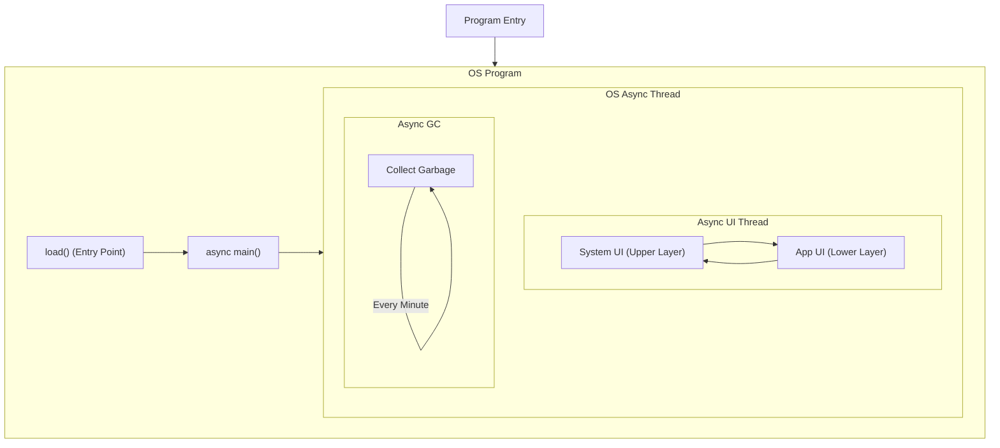
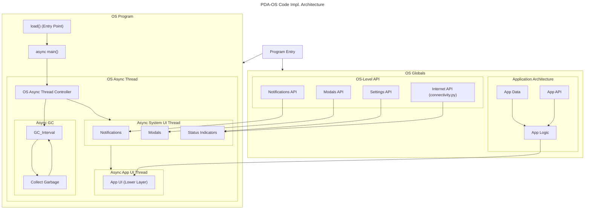

# General Purpose PDA
I'm working on this thing as a sort-of passion project, just to mess around and learn how hardware development works.

Oh, and to also practice writing python since I haven't done so for a long time.

> [!MATERIALS]
> - ESP32-S3-Touch-4.3-LCD from **WaveShare**
> - 3D printed case (.stl files here later)
> - A Type-C cable on both ends or on one end
> - A computer with a USB/Type-C port

I use macOS. I don't know if this will work on Windows or Linux, but I'll try to make it work on those platforms. (If it doesn't work on other platforms)

## OS Architecture in Code Implementation
I'm writing this in a separate section because it clarifies some things, for me, and for you, the user.

### Iteration 1
The graph below is the first iteration of the OS architecture. My current code (October 11, 2024, 10:40 AM UTC+8) can be represented with the graph.

This architecture is clear, simple, and easy to understand. However, it's not quite functional. Here's the downsides:
- The System UI and App UI are in the same thread. This means that if the System UI or the App UI is still processing or has multiple `asyncio.sleep()` calls, the entire thread will be delayed.
- The GC is not controlled by the OS. It's just a simple loop that runs every minute. This is not efficient and can cause performance issues.
- The Application Logic layer is not yet implemented.

### Iteration 2

- The Application Logic layer is now implemented.
- A New and better Async Jobs system
- The GC is now controlled by the OS. It's now a loop that runs every controlled duration

